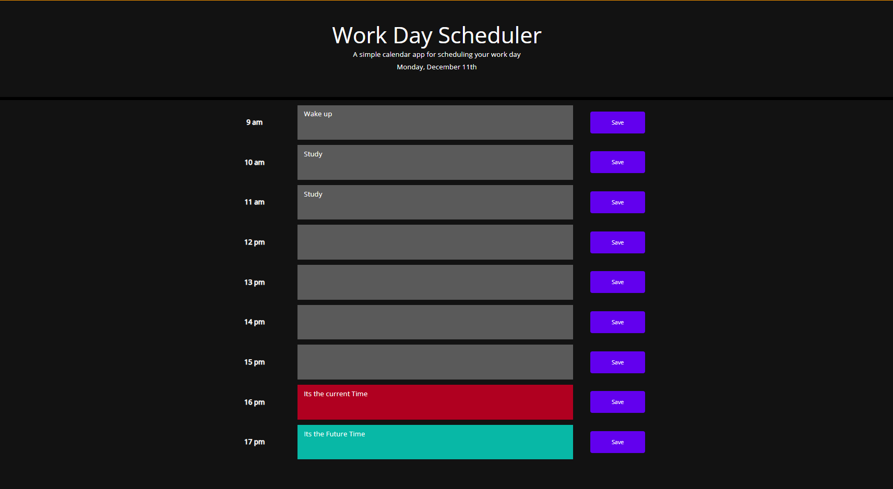

# work-day-scheduler
Setting reminders for yourself for each working hour of the day.
Link to Webpage: https://josh484.github.io/work-day-scheduler/
## Description 
This project uses what I have learnt over the last 2 weeks which includes DOM traversal and modifying HTML elements from the previous week and using 3rd Party APIs such as Jquery which simplifies javascript further and displayJS in order to get the time. 
All of this is shown as a work day scheduler.
## Installation
In order to install the project simply click the green code button and download the file as a zip. 
Once downloaded simply right click on the file and unzip the folder.
## Usage 
Once the file is downloaded you can open the index.html on your web browser you will be met with this page:
.

## Features
- this section will go through the javaScript.
- Firstly, using dayjs API todays time is taken and printed out onto the html page.
- Next there is an array of working day times and the current time in hours. For looping through the array does the following:
1. Create table elements for each time. 
2. if there is data for that time in the local storage output it to the text area html
3. output for each time in the array as either am or pm.
4. append all table contents to each row of the table where each row is a different time in the array.
- Note that the button is given an attribute which will be used later when the user saves as the saved id on the local storage.
5. if the in the array is greater, lower or equal than the current time than give the the row a different attribute either future, past or present. 
- lastly when the save button is clicked, traverse through the DOM to get the value of the text area in the same row as the clicked save button and save that value to the local storage.

